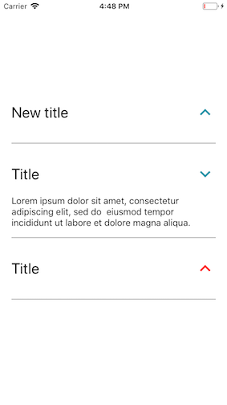

# Accordion



### Usage

```js
...
import { ScrollView, View } from 'react-native';
import { Accordion } from 'react-native-usit-ui';


...
  render() {
    return (
      <ScrollView
        style={{ flex: 1 }}
        contentContainerStyle={{
          alignItems: 'center',
          justifyContent: 'center'          
        }}
      >
        <View style={{ height: 150 }} />
        <Accordion title='New title' />
        <Accordion content='Lorem ipsum dolor sit amet, consectetur adipiscing elit, sed do  eiusmod tempor incididunt ut labore et dolore magna aliqua.'/>
        <Accordion color='red' />
      </ScrollView>
    )
  }
```


### API

| Prop    | Default    |     Type     | Description                                        |
| :------ | :--------- | :----------: | :------------------------------------------------- |
| title | `Title`    |  `string`   | Title of the accordion         |
| titleStyle   | `{ fontSize: 35 }`    |  `View.propTypes.style`   | Style object for title Text               |
| content    | `''`   | 'string' | Content of text when accordion is pressed                                 |
| contentStyle   | `{ fontSize: 15 }`  |   `View.propTypes.style`   | Style object for content Text                                |
| iconSize | `35` | `number` | Size of icon           |
| color   | `#2294A8`       |   `string`   | Color of the icon |
