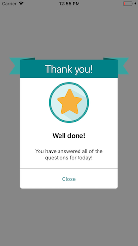

# AchievementModal



### Usage

To use this component, beware that react-native-svg have to be installed and
linked.

```js
...
import { View } from 'react-native';
import { AchievementModal, Button } from 'react-native-usit-ui';


...
  constructor(props) {
    super(props);
    this.state = {
      open: false
    };
  }

  render() {
    return (
      <View
        style={{ flex: 1, justifyContent: 'center', alignItems: 'center' }}
      >
        <Button onPress={() => this.setState({ open: !this.state.open})} />
        <AchievementModal
          visible={this.state.open}
          onClose={() => this.setState({ open: false}) }
        />
      </View>
    )
  }
```

### API

| Prop           | Default                                                             |                            Type                            | Description                          |
| :------------- | :------------------------------------------------------------------ | :--------------------------------------------------------: | :----------------------------------- |
| bannerTitle    | `Thank you`                                                         |                          `string`                          | Title of the banner                  |
| bannerColor    | `{ primary: '#008187', secondary: '#0E5956', tertiary: '#36A3A0' }` | `{ primary: string, secondary: string, tertiary: string }` | Color of the SVG banner              |
| icon           | `<Image source={require('./star.png')} />`                          |                    `React.Component<*>`                    | Icon to be used                      |
| title          | `Well done!`                                                        |                          `string`                          | Title of the achievement             |
| description    | `You have answered all of the questions for today!`                 |                          `string`                          | Description of you achievement       |
| visible        | `false`                                                             |                         `boolean`                          | Determine if modal is visible or not |
| onClose        | `undefined`                                                         |                        `() => void`                        | Callback for closing the modal       |
| closeText      | `Close`                                                             |                          `string`                          | Close button text                    |
| closeTextColor | `#008187`                                                           |                          `string`                          | Close button text color              |
| animationType  | `fade`                                                              |                `'none' | 'fade' | 'slide'`                 | Animation type of modal              |
