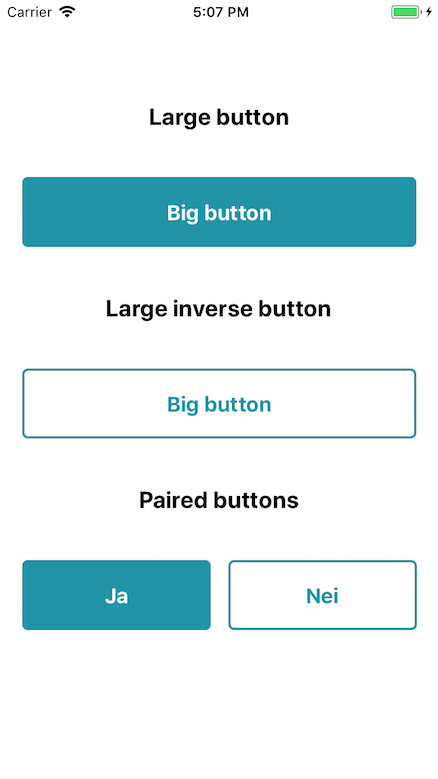

# [Button]



### Usage

```js
...
import { Dimensions, View } from 'react-native';
import { Button } from 'react-native-material-ui';

const { width } = Dimensions.get('window')

...
  render() {
    return <View>
        <Button style={{ marginVertical: 40 }} large />
        <Button style={{ marginVertical: 40 }} large inverse />

        <View
            style={{
                flexDirection: "row",
                width: width * 0.9,
                justifyContent: "space-between"
                }}>
          <Button style={{ marginVertical: 40 }} text="Ja" />
          <Button style={{ marginVertical: 40 }} text="Nei" inverse />
        </View>
      </View>;
  }
```

### API

```js
type Props = {
    inverse?: boolean,
    large?: boolean,
    text: string,
    color?: string,
    onPress: () => void,
    style?: Object
};

static defaultProps = {
    inverse: false,
    large: false,
    text: 'Big button',
    color: colors.primary,
};
```
