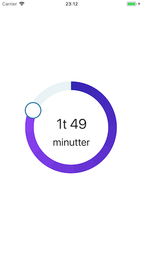

# Accordion



### Usage

```js
...
import { View } from 'react-native';
import { CircularTimeSlider } from 'react-native-usit-ui';


...
  render() {
    return (
      <View
        style={{
          flex: 1,
          justifyContent: 'center',
          alignItems: 'center',
        }}
      >
        <CircularTimeSlider />
      </View>
    )
  }
```

### API

| Prop              | Default    |           Type            | Description                                                                                                                                     |
| :---------------- | :--------- | :-----------------------: | :---------------------------------------------------------------------------------------------------------------------------------------------- |
| hourUnit          | `t`        |         `string`          | Unit for hour                                                                                                                                   |
| minuteUnit        | `minutter` |         `string`          | Unit for minute                                                                                                                                 |
| segments          | `10`       |         `number`          | SVG doesn't support canonical gradients, so it's imitated by using multiple linear gradients across the slider. In most cases 5 should be fine. |
| radius            | `120`      |         `number`          | Size of whole slider                                                                                                                            |
| strokeWidth       | `25`       |         `number`          | Width of slider                                                                                                                                 |
| gradientColorFrom | `#3023AE`  |         `string`          | Initial gradient color of slider                                                                                                                |
| gradientColorTo   | `#8f42f4`  |         `string`          | Final gradient color of slider                                                                                                                  |
| bgCircleColor     | `#E9F2F5`  |         `string`          | Color of the circle under the slider (pathway for a slider)                                                                                     |
| onValueChange     | `() => {}` | `(value: number) => void` | The value returned when moving the slider button is unformated.                                                                                 |
