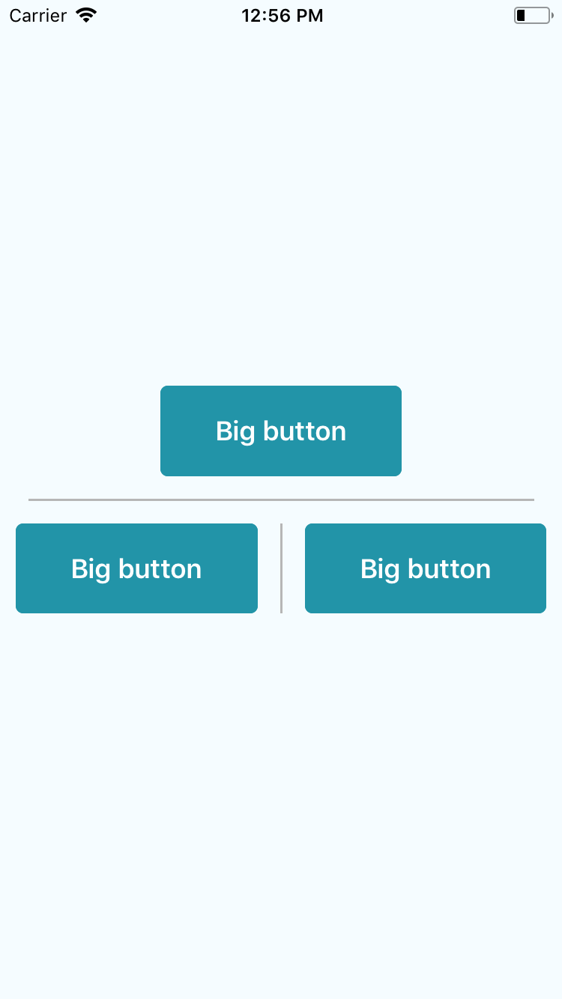

# Divider



### Usage

```js
...
import { View } from 'react-native';
import { Divider, Button } from 'react-native-usit-ui';

...
  render() {
    return (
      <View
        style={{
          flex: 1,
          justifyContent: 'center',
          alignItems: 'center',
        }}
      >
        <Title />
        <Button />
        <Divider />
        <View style={{ flexDirection: 'row' }}>
          <Button />
          <Divider vertical />
          <Button />
        </View>
      </View>
    )
  }
```

### API

```js
type Props = {
  vertical? boolean,
  size?: number | string,
  style?: Object,
};

defaultProps = {
  size: '90%',
}

default style = {
  width: vertical ? 1.5 : size,
  height: vertical ? size : 1.5,
  marginVertical: vertical ? 0 : 15,
  marginHorizontal: vertical ? 15 : 0,
  backgroundColor: '#B6B6B6',
}
```
