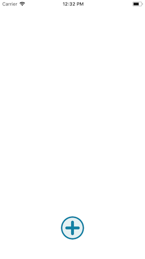
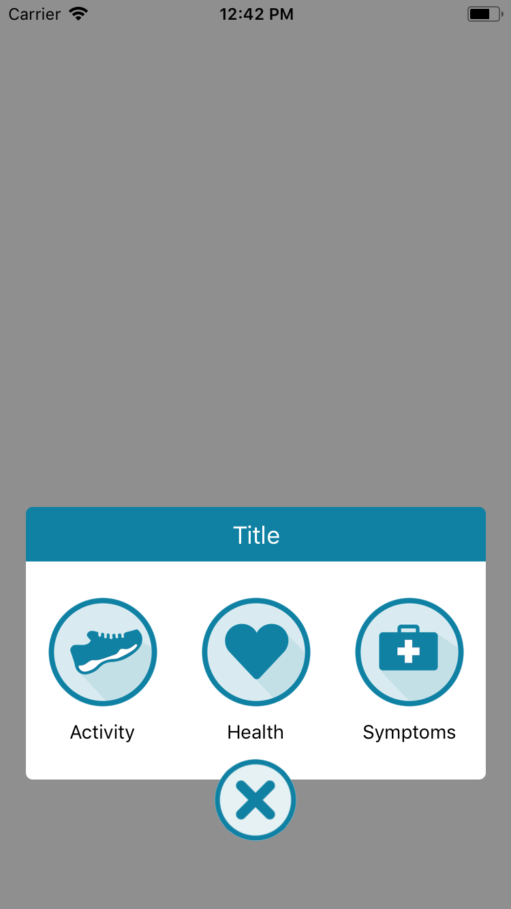

# FloatingButton




### Usage

```js
...
import { TouchableOpacity, Image, View } from 'react-native';
import { FloatingButton } from 'react-native-usit-ui';


const CardButton = ({ text, icon }) =>
  <View style={{ flex: 1, justifyContent: 'center', alignItems: 'center' }}>
    <TouchableOpacity>
      <Image source={icon} style={{ height: 80, width: 80 }} />
    </TouchableOpacity>
    <Text style={{marginTop: 10 }}>{text}</Text>
  </View>

const icons = [
  { text: 'Activity', icon: require('./shoe.png') },
  { text: 'Health', icon: require('./health.png')},
  { text: 'Symptoms', icon: require('./symptom.png')}
]
...
  render() {
    return (
      <View style={{ flex: 1, justifyContent: 'center'}}>
        <FloatingButton>
          {icons.map((element, index) => (
            <CardButton key={index} text={element.text} icon={element.icon} />
          ))}
        </FloatingButton>
      </View>
    )
  }
```

### API

| Prop            | Default        |   Type   | Description                                                  |
| :-------------- | :------------- | :------: | :----------------------------------------------------------- |
| color           | `'#1081A3'`    | `string` | Color of the button border, X mark and card title area       |
| colorBackground | `#E5F1F3`      | `string` | Color of the background inside main button                   |
| size            | `60`           | `number` | Size of the button.                                          |
| marginBottom    | `50`           | `number` | Margin from bottom of the screen to button                   |
| title           | `Title`        | `string` | Title of the floatingbutton                                  |
| cardHeight      | `height * 0.3` | `number` | Height of the are of the card content                        |
| children        | `undefined`    |  `any`   | Children of the component to render inside card area content |
