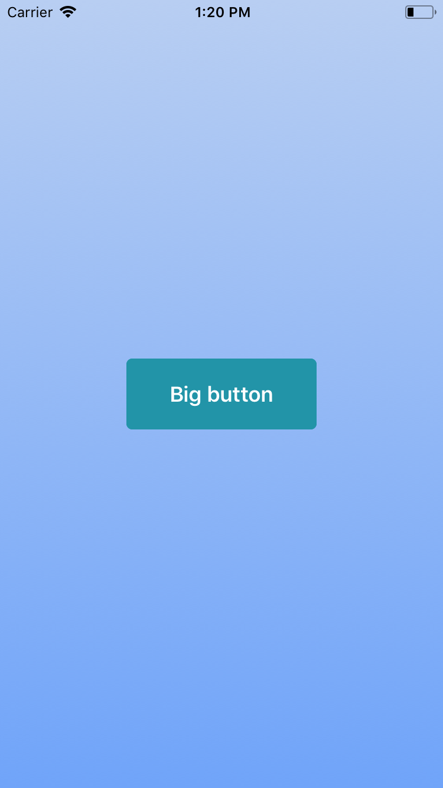

# GradientBackground



### Usage

```js
...
import { View } from 'react-native';
import Icon from 'react-native-vector-icons/MaterialIcons';
import { GradientBackground, Button } from 'react-native-usit-ui';

...
  render() {
    return (
      <View style={{ flex: 1, alignItems: 'center', justifyContent: 'center' }}>
        <GradientBackground
          fromColor="#b8cef2"
          toColor="#40a4f9"
          direction="topToBottom"
        />
        <Button />
      </View>
    );
  }
```

### API

| Prop      | Default       |        Type         | Description               |
| :-------- | :------------ | :-----------------: | :------------------------ |
| fromColor | `#b8cef2`     |      `string`       | start color of gradient   |
| toColor   | `#40a4f9`     |      `string`       | end color of gradient     |
| direction | `topToBottom` | `GradientDirection` | direction of the gradient |

```js
type GradientDirection = 'leftToRight' | 'topToBottom';
```
