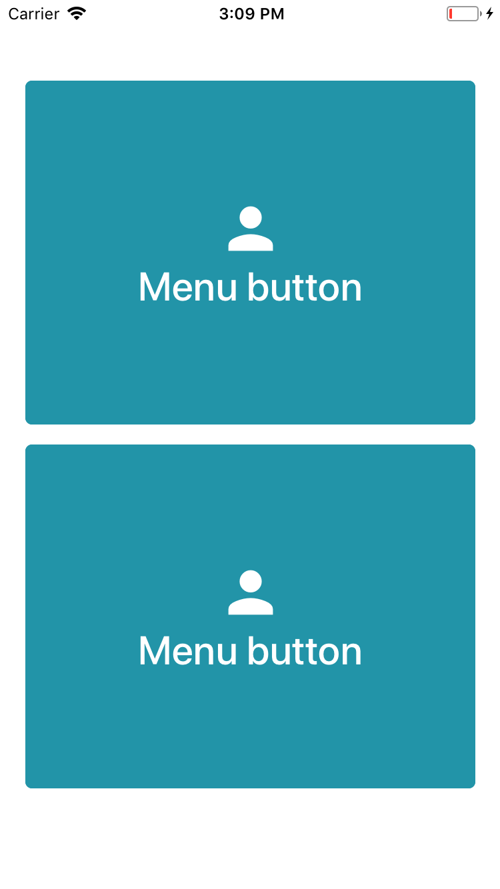
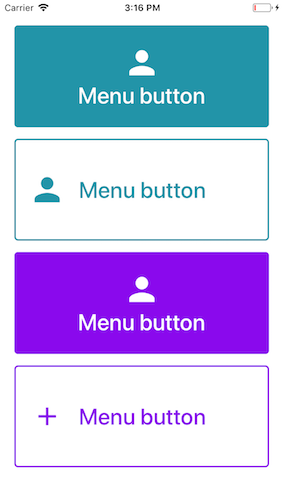

# MenuButton




### Usage

```js
...
import { View } from 'react-native';
import { MenuButton } from 'react-native-usit-ui';

...
  render() {
    return
      <View
        style={{
          flex: 1,
          justifyContent: 'center',
          alignItems: 'center',
        }}
      >
        <View style={{ flex: 0.9 }}>
          <MenuButton />
          <MenuButton setElementsHorizontal inverse />
          <MenuButton color="#8a09ed" />
          <MenuButton
            setElementsHorizontal
            disabled
            color="#8a09ed"
            icon={<Icon name="add" size={40} color="gray" />}
          />
        </View>
      </View>
  }
```

### API

| Prop                  | Default                                                                           |         Type         | Description                                                                            |
| :-------------------- | :-------------------------------------------------------------------------------- | :------------------: | :------------------------------------------------------------------------------------- |
| text                  | `'Menu button'`                                                                   |       `string`       | text in button                                                                         |
| onPress               | `() => {}`                                                                        |     `() => void`     | action to occur when button is pressed                                                 |
| color                 | `#2294A8`                                                                         |       `string`       | color of the button and icons                                                          |
| setElementsHorizontal | `false`                                                                           |      `boolean`       | Set both the text and icon horizontal                                                  |
| fontSize              | `30`                                                                              |       `number`       | FontSize of text                                                                       |
| disabled              | `false`                                                                           |      `boolean`       | Set the color of button to gray and disable onPress on button                          |
| inverse               | `false`                                                                           |      `boolean`       | Invert the color of button and disable onPress on button                               |
| icon                  | `<MaterialIcons name="person" size={50} color={disabled ? color : colors.white}>` | `React.Component<*>` | Icon in button. Can be any component like react-native-vector-icons or Image component |
| style                 | `null`                                                                            |       `Object`       | Style of the button container                                                          |
| textStyle             | `null`                                                                            |       `Object`       | Style of the text inside the button                                                    |
