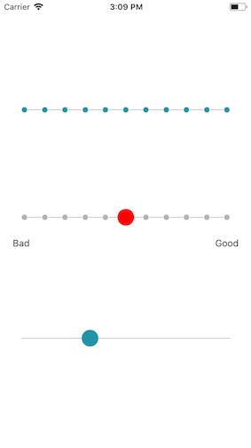

# Slider



### Usage

```js
...
import { View } from 'react-native';
import { Slider } from 'react-native-usit-ui';

...
  render() {
    return (
      <View
        style={{
          flex: 1,
          alignItems: 'center',
          justifyContent: 'center',
          backgroundColor: 'white',
        }}
      >
      <View style={{ height: 500, justifyContent: 'space-around' }}>
        <Slider max={10} />
        <Slider max={10} color="red" labels={['Bad', 'Good']}/>
        <Slider vertical/>
        </View>
      </View>
    )
  }
```

### API

| Prop          | Default                                                                                 |          Type          | Description                                                                                                         |
| :------------ | :-------------------------------------------------------------------------------------- | :--------------------: | :------------------------------------------------------------------------------------------------------------------ |
| size          | `width * 0.9`                                                                           |        `number`        | Width of the whole slider                                                                                           |
| initialValue  | `-1000`                                                                                 |        `number`        | Value of the position of the thumb button. Beware that value outside of min or max will set position outside slider |
| min           | `0`                                                                                     |        `number`        | Minimum and left side value of slider                                                                               |
| max           | `100`                                                                                   |        'number'        | Maximum and right side value of slider                                                                              |
| labels        | `null`                                                                                  |    'Array<string>'     | Labels under the slider                                                                                             |
| vertical      | `null`                                                                                  |       'boolean'        | Rotate slider to vertical position                                                                                  |
| hideMarkers   | `false`                                                                                 |       `boolean`        | Markers are only visible if max is 10 or below due to design. If true, you can still hide markers with this prop    |
| color         | `#2294A8`                                                                               |        `string`        | Color of both marker and thumb button                                                                               |
| onValueChange | `() => {}`                                                                              |      '() => void'      | Callback for slider position change                                                                                 |
| lineStyle     | `{ backgroundColor: '#b3b3b3', height: 1}`                                              | 'View.propTypes.style' | Style object for the slider line                                                                                    |
| markerStyle   | `{ width: 10, height: 10, borderRadius: 10 / 2, borderWidth: 1, borderColor: 'white' }` | 'View.propTypes.style' | Style object for the markers                                                                                        |
| thumbstyle    | `{ width: 25, height: 25, borderRadius: 25 / 2 }`                                       | `View.propTypes.style` | Style object for the thumb button                                                                                   |
