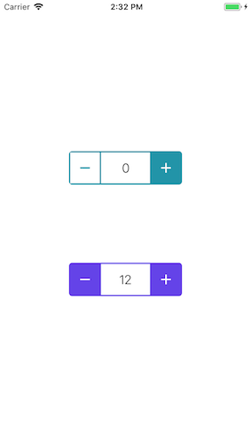

# Button



### Usage

```js
...
import { View } from 'react-native';
import { Stepper } from 'react-native-usit-ui';

...
  render() {
    return ()
      <View
        style={{
          flex: 1,
          alignItems: 'center',
          justifyContent: 'space-around',
        }}
      >
        <View style={{ flex: 0.5, justifyContent: 'space-around' }}>
          <Stepper onChange={value => console.log(value)} />
          <Stepper maxValue={20} initialValue={12} color="#6443e8" />
        </View>
      </View>
    )
  }
```

### API

```
| Prop      | Default    | Type         | Description                                        |
| :-------- |:-----------|:------------:|:---------------------------------------------------|
| interval     | 0.5    | number    | The interval value to increase/decrease for each press on button
| longHoldInterval     | 2    | number    | When holding for more than approx. 2 sec the interval increase with a different value
| maxValue      | number   | Number.MAX_VALUE | Max limit for value
| onChange | () => {} | () => void | Callback when value changes
| color     | #2294A8  | string     | Color of the stepper
| initialValue   | number | 0 | Initial value to be shown in stepper
```
